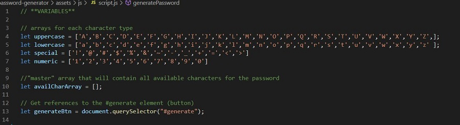
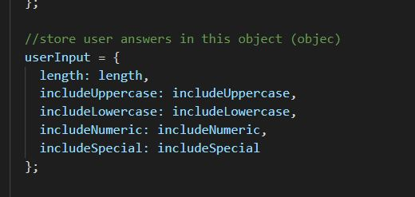
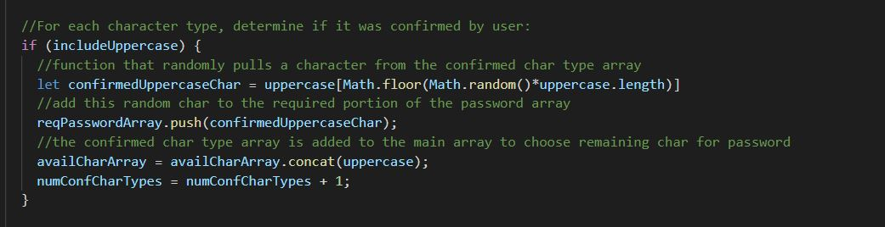
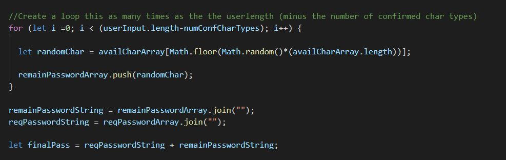

# Password Generator

**This is a README for the creation of a password generator.  The aim of the password generator was to present criteria to a suer and produce a randomized password based on the users input.  I utilized my developing skill set in JavaScript create this application.  Some of the JavaScript methods and skills I used are noted below:**

* Comments were added to the script.js file as pseudocode and organization purposes.
* Arrays were defined on a global scope for refernce and use throughout the script:

* An eventListener was utilized to initiate the generatePassword ().
* An object was declared to store the user input:

* If statments were used to help determined if the user selected specific criteria:

* The Math.random() was utilzied in selecting random characters from an array
* The .concat() method and the .join() method were also used in the creation of the password
* A For loop was utilzied to run a piece of code a specific amount of times:

* A querySelector () method was utilized to display the final result on the browser

## Deployed Application

* [Password Generator](https://github.com/erin-michon/password-generator/settings/pages)

## Future Goals
* Refactor the code